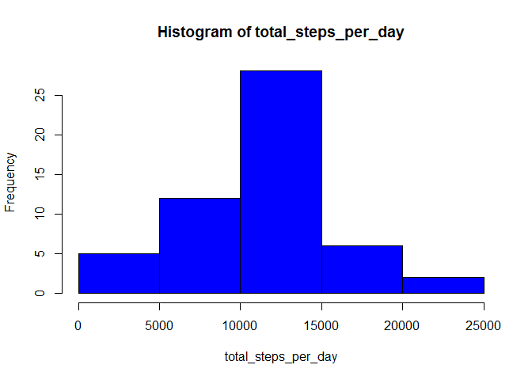
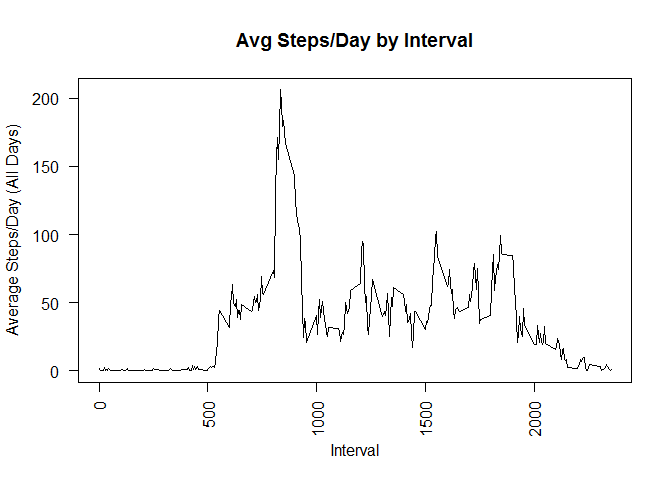
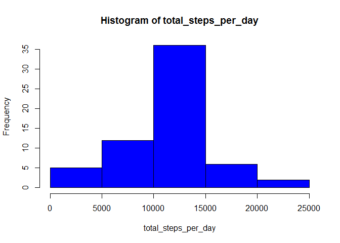
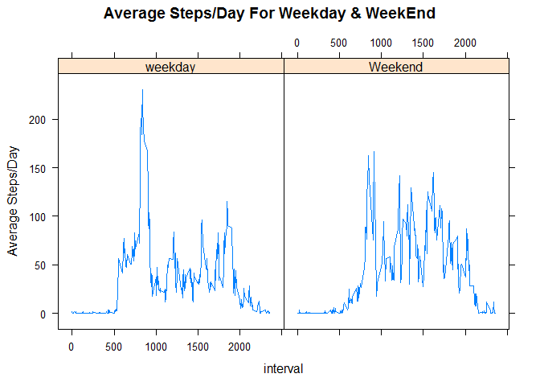

# Reproducible Research: Peer Assessment 1


```r
library(dplyr, quietly = TRUE, warn.conflicts = FALSE)
library(lubridate,quietly = TRUE,warn.conflicts = FALSE)
library(lattice,quietly = TRUE,warn.conflicts = FALSE)
```

## Loading and preprocessing the data

```r
# Load Data - assumes that the file is in the root location
repdt <- read.csv("activity.csv", header=TRUE)

# Convert to data.frame using dplyr package
repdt <- tbl_df(repdt)
```


## What is mean total number of steps taken per day?
### 1. Total Steps Per Day

```r
# Compute total steps/day - group data by date, compute sum
print(repdt %>% 
        group_by(date) %>% 
                summarise(total_steps_per_day=sum(steps)))
```

```
## Source: local data frame [61 x 2]
## 
##          date total_steps_per_day
## 1  2012-10-01                  NA
## 2  2012-10-02                 126
## 3  2012-10-03               11352
## 4  2012-10-04               12116
## 5  2012-10-05               13294
## 6  2012-10-06               15420
## 7  2012-10-07               11015
## 8  2012-10-08                  NA
## 9  2012-10-09               12811
## 10 2012-10-10                9900
## ..        ...                 ...
```

### 2. Histogram Plot of Total Steps Per Day

```r
# plot histogram of total steps/day - group data by date, compute sum, plot
repdt %>% 
        group_by(date) %>% 
                summarise(total_steps_per_day=sum(steps)) %>% 
                        with(hist(total_steps_per_day,col = "blue"))
```

 

### 3. Mean and Median of Total Steps per Day

```r
# mean and mediam of total steps/day - group data by date, compute sum --> comp mean/med of sum
repdt %>% 
        group_by(date) %>% 
                summarise(tmp=sum(steps)) %>%
                        summarise(mean = mean(tmp,na.rm=TRUE), median=median(tmp,na.rm=TRUE))
```

```
## Source: local data frame [1 x 2]
## 
##       mean median
## 1 10766.19  10765
```


## What is the average daily activity pattern?
### 1. Plotting a time series of average steps/day across all days by interval

```r
# group data by interval, compute mean of steps, and plot mean vs. interval
repdt %>% 
        group_by(interval) %>% 
                summarise(mean_steps=mean(steps, na.rm=TRUE)) %>%
                        with(plot(x=interval,y=mean_steps,type="l",las=2,main="Avg Steps/Day by Interval", xlab="Interval", ylab="Average Steps/Day (All Days)"))
```

 

### 2. Computing the interval with the highest average steps/day across all days

```r
# group data by interval, compute mean of steps, arraneg desc by avg_steps and head(1)[1]
repdt %>% 
        group_by(interval) %>% 
                summarise(mean_steps=mean(steps, na.rm=TRUE)) %>%
                        arrange(desc(mean_steps)) %>% head(1)[1]
```

```
## Source: local data frame [1 x 1]
## 
##   interval
## 1      835
```


## Inputing missing values
### 1. Total number of rows with missing data in the data set

```r
# group data by interval, compute mean of steps, arraneg desc by avg_steps and head(1)[1]
dim(filter(repdt,is.na(steps)))[1]
```

```
## [1] 2304
```

### 2. Fill missing values with mean of interval
#### We use the following strategy here to input missing data
##### a. Compute the average steps/day across all days for each interval and store in a temp var
##### b. Make a copy of the original data set
##### c. Loop through each item in the copy of the data set and check if steps is N/A
##### d. If NA, use the corresponding interval to reference the temp var and populate N/A with mean

```r
# group data by interval, compute mean of steps, and store in a temp variable
int_mean <- repdt %>% group_by(interval) %>% summarise(mean=mean(steps,na.rm=TRUE))

# Fill data from temp variable
repdt_comp <- repdt
for(i in 1:nrow(repdt_comp)) {
        if(is.na(repdt_comp[i,1])) {
                repdt_comp[i,1] <- filter(int_mean,interval==as.numeric(repdt_comp[i,3]))[2]
        }       
}
```

###3. Print out the new data set with missing values filled in

```r
print(repdt_comp)
```

```
## Source: local data frame [17,568 x 3]
## 
##        steps       date interval
## 1  1.7169811 2012-10-01        0
## 2  0.3396226 2012-10-01        5
## 3  0.1320755 2012-10-01       10
## 4  0.1509434 2012-10-01       15
## 5  0.0754717 2012-10-01       20
## 6  2.0943396 2012-10-01       25
## 7  0.5283019 2012-10-01       30
## 8  0.8679245 2012-10-01       35
## 9  0.0000000 2012-10-01       40
## 10 1.4716981 2012-10-01       45
## ..       ...        ...      ...
```

###4. Hist of data set with missing values filled in

```r
# plot histogram of total steps/day - group data by date, compute sum, plot
repdt_comp %>% 
        group_by(date) %>% 
                summarise(total_steps_per_day=sum(steps)) %>% 
                        with(hist(total_steps_per_day,col = "blue"))
```

 

```r
# mean and mediam of total steps/day - group data by date, compute sum --> comp mean/med of sum
repdt_comp %>% 
        group_by(date) %>% 
                summarise(tmp=sum(steps)) %>%
                        summarise(mean = mean(tmp), median=median(tmp))
```

```
## Source: local data frame [1 x 2]
## 
##       mean   median
## 1 10766.19 10766.19
```
#### The impact of inputting missing values is that the mean remains the same but the median is now the same as the mean whereas there is a small difference between the mean and teh median in the data set with missing values

## Are there differences in activity patterns between weekdays and weekends?
### 1. Generate TIme series plot by weekday/weekend

```r
# Add dayofweek, find out weekday or weekend, group_by daytype and interval and then plot
repdt_comp %>%
        mutate(dayofweek=wday(date)) %>%
                mutate(daytype=ifelse(dayofweek==1 | dayofweek==7,"Weekend","weekday")) %>%
                        group_by(daytype, interval) %>% summarise(mn=mean(steps)) %>%
                                xyplot(mn~interval|daytype,data=., type="l", ylab="Average Steps/Day", main="Average Steps/Day For Weekday & WeekEnd")
```

 
